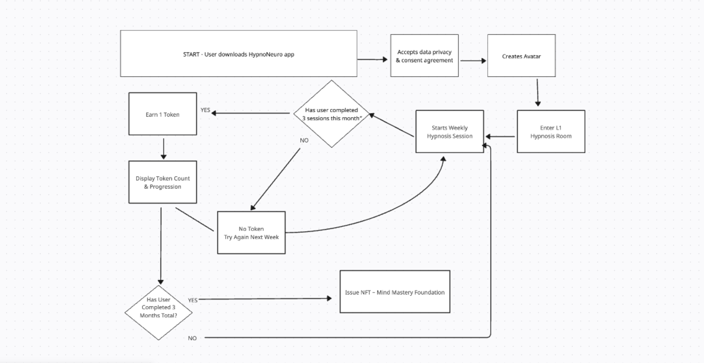

# HypnoNeuro Mind Loop

**A gamified behavioral engine combining naturopathic neuroscience, orthomolecular medicine, and daily micro-interventions to support emotional healing and mental clarity.**

HypnoNeuro Mind Loop is the therapeutic core of the HypnoNeuro ecosystem. It empowers users to complete behavior-based "loops" that retrain the nervous system, regulate emotions, and apply food-mood strategies through guided, game-integrated actions.

## 🎮 Core Features

- **Loop Modules**: Each loop focuses on a therapeutic theme (e.g., Laundry Loop, Nourish Circuit) and offers prompts, mood-based choices, and real-life applications.
- **Orthomolecular Nutrition**: Game recipes are designed to support neurotransmitter and neuropeptide balance (serotonin, dopamine, GABA, and endorphins) using nutrients like tryptophan, tyrosine, magnesium, and mood-elevating whole foods.
- **Nervous System Repatterning**: Players engage in symbolic micro-actions like folding, sorting, breath pacing, or sensory focus to downshift from emotional overload.
- **Real-Life Carryover**: All in-game activities are modeled after actionable, real-world habits — from grounding routines to mood-specific meals and dopamine-endorphin snack pairings.

## 🧠 Use Cases

- **Players**: Seeking natural, gamified healing tools without pharmaceutical dependency.
- **Practitioners**: Guiding clients using lifestyle medicine, food-mood tracking, and avatar-supported interaction.
- **Educators**: Teaching trauma-informed behavior change, orthomolecular strategies, and digital wellness literacy.
- **Investors & Partners**: Exploring the intersection of mental health, Web3, and decentralized healing technologies.

## 🚀 Sample Modules

- `laundry_loop.md` — Use symbolic sorting, visualization, and movement to clear mental static and re-center.
- `nourish_circuit.md` — Build awareness of how specific foods influence neurotransmitter function and emotional states, with mood-based snack examples.

---

This repo is part of the broader **HypnoNeuro** platform — a decentralized, trauma-informed system for avatar-based mental wellness and therapeutic game design.

## 🧠 HypnoNeuro Level 1 Flowchart

This diagram illustrates the onboarding and token logic for Level 1 (Hypnosis Room) within the HypnoNeuro platform.

## 🎮 Mind Loop Modules

- [Mind Loop: Clean Cycle](./mind-loop_clean-cycle.md) — Laundry-themed behavior loop to reset emotional energy.
- [Mind Loop: Nourish](./nourish_circuit.md) — Food-based loop for calming neurotransmitter support.

